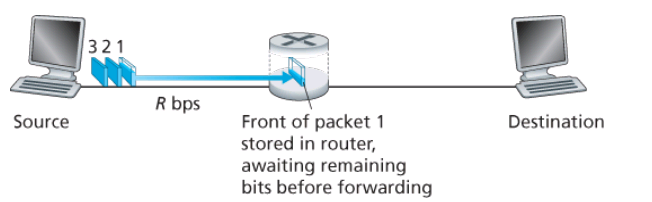

# Chapter 1 Computer Networks and the Internet

- The internet is a **Packet Switched** (First come first served, on demand; no reservation of resources like buffer, link transmission rate) n/w as opposed to **Circuit Switched** (resources reservedfor the duration of communication)
  - It is a n/w of n/ws with ISP tiers (national and international ISPs are upper tier ISPs (Rogers, AT&T) connecting to Regional ISPs) conecting to lower level ISP tier that in turn connect to WANs that in turn connect may or may not connect to other WANs. Your home n/w may be one such WAN

- Devices connected to each other that typically sit at the edge of the n/w (Network Edge) are called **end s/ms** or **hosts**. They are connected to each other via communication links and packet switches (routers and link-layer switches)
  - Routers - n/w core
  - Link Layer switches - Access n/ws (the first packet switch, edge router, that connects to the end s/m directly)

  

  - End s/ms connecting to (or wanting to connect to or wanting to transfer data with) other end-s/ms via the Internet infra do so by providing a **socket interface** that specify how they should connect
  - End s/ms can be **clients** or **servers**

- ISP is a n/w of packet switches and communication links

- A **protocol** defines the rules of engagement for exchanging/accessing information (includes how to connect)

- When sending something from a src end-s/m to dest end end s/m the src breaks the message into smaller chunks called packets

- Home Internet Access
  - DSL - Digital Subscriber Line (telco)
    

    - Coaxial cable
    - Modem converts digital to analog tones to transmit over the telephone wire, which gets converted back to digital at the DSLAccessMultiplexer at the Central Office (CO)
    - Home phone lines carry data and telephone signals simultaneuosly
      - Downstream Channel (high speed) - 50 - 1MHz
      - Upstream Channel (med speed) - 4 - 50 KHz
      - Two way telephone channle - 0 - 4KHz
  - Cable (DOCSIS, Cable company)
    - Use cableTV company's existing line
    - Hybrid Fiber Coax (HFC)
    

    - Cable Modem Termination s/m (CMTS) works much like DSLAM
    - Downstream channel - 42.8 Mbps Dictatec by DOCSIS 2.0 standard
    - Upstream channel - 30.7 Mbps
  - FTTH - (Fiber To The Home)
    

    - Optical Fiber form CO to home
    - Line shared by many homes, not until it gets close to the home does it split and connect directly
    - 2 Archs
      - Passive Optical Networks (PON)
      - Active Optical Networks (AON)
    - Each home has a ONT (Optical n/w Terminator) that connects to a neighborhood Optical Splitter connecting to a single shared Optical fiber that connects to OLT (Optical Line Terminator) in the CO
  - Satellite
    - Geostationary and LEO (Moon rotation sync)

- Packet switches store the packets in a buffer before sending out to the transmission link

- Routing protocols in packet switches set forwarding tables that contain the address (IP) to the next hop or the destination for the packet

- Delays in Packet Switched networks are Processing Delay (Time taken by the node/packet switch to inspect packet header), Queueing delays (buffer filled up other packets need to wait; µs - ms), transmission delays(Lenthof packet / TransmissionRateofLink; µs - ms) and propagation delays (time taken to go from one router to next; ms). These add up to a Nodal Delay

- Internet Protocol Stack (IP Stack)
  - Each layer below provides services to the layer above via a well defined API
  - End systems (PCs etc) implement all the layers while Link Layer switches only implement Physical and Link layers and routers implement Network, Link adn Physical

  - App Layer protocols (Distributed in nature) and Trnasport Layer protocols are encoded in software, Link Layer and Physical Layer are embedded in hardware (n/w interface card). N/w layer protocols are mix between hardware and software

  - Transport layer implements TCP and UDP protocols (Move segments)
    - TCP
      - Connection Oriented (handshake, establish connection first)
      - guaranteed delivery (reliable)
      - flow control (src and dest speed matching)
      - breaks long messages into chunks
      - congestion control
      - When server tells TCP to close connection, it doesn't, not till data has been received by the client
      - TCP uses three way handshake between client and server
        - small TCP segment sent to server (SYN; Wireshark snooping)
        - server acknowledges (SYN, ACK)
        - client acknowledges (ACK)
    - IP running in the Network layer doesn't guarantee packet delivery nor order and hence if these qualities are desired, TCP is used (colloquially called TCP/IP)
    - UDP (Live Streams)
      - Connection less (no handshake)
      - No reliability
      - No congestion control

  - Network Layer (Moves Datagrams) implements the IP (Internet Protocol)

  - Link Layer implements the Ethernet, WiFi, DOCSIS standards (Move Frames)
    - Devices that work here don't understand IP addresses but Ethernet addresses

  - Physical Layer is tasked with moving individual bits

- The OSI model, was before the IP stack and to me it seems like it separates layers (concerns of each) more granularly

- Encapsulation
  - Each layer in the IP stack encapsulates the information from the layer above

  
