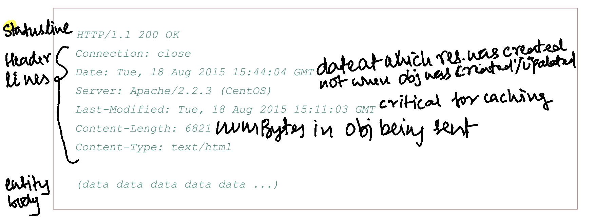

# Chapter 2 Applications Layer

## Network Application Arch

- Application Arch is diff from n/w arch
- Common Archs
  - Client-Server (entire web platform)
    - Always on server
    - relaince on server
    - central authority
    - most apps on the web
  - P2P Arch
    - minimal to no interaction with a server
    - app leverages conn b/w intermittently connected hosts, called peers
    - Many traffic intensive aplications use a P2P arch, like IM apps, central server to recognize and track users but user to user message are sent directly (Skype; Internet telephony services); Another application is peer assisted downloads; Maybe Netflix should use this instead of the CDN in ISP approach
    - Security, performance and reliability challenges

## Processes

- It is processes that talk to each other not programs (programs are processes running in a OS not the converse); Processes running on the same host s/m talk to each other via IPC (Inter Process Comm) governed by the rules of the OS (The same over the n/w would be RPC but goverened by the protocol?)

- The interface b/w the app the n/w is the **socket** (API between app and transport layer)

- App (process running in the app layer) has limited control over the transport layer
  - What Protocol to use? (TCP, UDP or RTP; Real time protocol)
  - Ability to set max buffer and segment size

### Addressing Processes

- IP: host identifier
- PORT: process identifier

## Transport Layer Services Available to Apps

- Reliable Data Transfer - gauranteed data delivery (TCP)
- Throughput (not provided by internet; applications use smart arch to workaround)
  - rate at which sending process delivers messages to recieving process
  - apps that have definitve throughput reqs are bandwidth-sensitive apps as oppossed to elastic apps that can operate on meager bandwidth
- Timing (not provided by internet; applications use smart arch to workaround) - An upper bound on timing for a message (stream of bits) to appear at the detination (say, in 200ms all bits sent by the sender will reach rxr)
- Security - encryption

## HTTP

- implemented in two programs, client and server
- WebPage : Objects :: 1 : n
  - Objects can be HTML page, img, vid
  - One base HTML pg and several objects referenced by URL
    - URL is composed of
      - host (linkedin.com)
      - object path (/profiles/SaiKrishnaMohan)
- Stateless, forgets what was sent to which client after connecion is terminated; Same object can be sent back if client asks for it in a few sec (cookies are used to store state, recognize clients)
- Nothing to do with how a WebPage is interpreted by a client only how the client gets that info

### Persistent and Non-persistent conenctions

- data tarnsfer over same TCP connection - Persistent
- data tarnsfer over same TCP connection - Non-Persistent
- default - persistent (maybe old)
- 11 TCP connections are generated when a clien requests a web page
  - Most browsers open 5 to 10 parallel TCP connections; All assests required to render a WebPage are fetched in parallel

### HTTP with persistent connection

- Non persistent connections have shortcomings
  - TCP buffer and vars need to be maintained for each requested object by the server, burdensome
- Enter HTTP 1.1
  - Persistent connections with pipelining (send all requests without waiting on response for the prev req) as default; All assets requested are sent over same connection
  - HTTP server closes connection after certain configurable time has passed
- HTTP/2
  - Multiple req and res in the same connection (not 10 parallel connections; not as clear, no practical exp yet...)
  - reqs adn res can be prioritized

### HTTP Request message

### HTTP Response Message

### User - Server Interaction - Cookies

- 4 components of the user-server interactions with cookies; Session layer atop stateless HTTP
  - `Cookie` header in HTTP res
  - `Cookie` header in HTTP req
  - cookie file on the client's host managed by browser
  - persistent storage used by the server

- ...Post establishing TCP conn.
  - Client sends a HTTP req to the server
  - Server creates a uniqueId and saves it to the db keyed (indexed if relational db) by the uniqueId replies back with `Set-Cookie`: `<uniqueId>`
  - Client browser writes a new line in the cookie file, that it maintains, with the server hostname and the `<uniqueId>` (dated... upon inspection in Chrome, it seems like stuff is stored in cache, localStorage, db and some serviceWorker)

  ...Some long time later...
  - Client makes a req to the same server, this time though, the browser knows the host the user is trying to contact and sets the `Cookie: <uniqueId>` header when sending the req and therefore allowing the server to recognize user
  - As the client continues to browse WebPages, the browser sets `Cookie: <uniqueId>` each time

### Web Caching (Proxy servers, network caches and CDNs)

- Proxy servers, network caches and CDNs, same basic concept, cater to a request on behalf of the server
- Typically bought and maintained by ISP (Uni)
- eases congestion of hte access link for smaller ISPs like unis

#### Conditional GET

- Cached object maybe stale, if so, get from server
  - HTTP Method should be GET
  - `If-modified-since:` header line is included
- Think about normal interaction with web server, hits a cache a miss happens
  - Cache sends req to server, server responds with `Last-Modified:` header set
  - Cache forwards res to client and saves the object locally with the `Last-Modified:` header
  - When same object requested after a while, couple of days, the cache checks with server if objected saved locally is cached by setting the `If-modified-since: <valueOf Last-ModifiedHeader FromWhenCacheRequestedObjFromServer>`
    - if not stale, server responds with `304 Not Modified` with no body (so way quicker), the cache responds with the saved obj to the client
    - if stale then the usual thing happens

## DNS - Domain Name System

- Is a distributed DB implemented as:
  - A hierarchy of servers, Domain Name Servers
  - App layer protocol that determines rules to access the info on the DB
    - DNS protocol runs over UDP, port 53 (query and reply messages are inside UDP Datagrams), running Berkley Internet Name Domain (BIND)
      - DNS protocol is also implemented as a client-server application with the client side running on teh user's host and the server side on a DNS server
      - When the user tries to access a WebPage on some server, the browser extracts the hostname and passes it to the client side of DNS which then contacts a DNS server to get the IP address of the server
      - Once IP is received, and passed to the application, our TCP handshake story begins
- Other than hostname to IP translation, DNS provides follwing services:
  - **_Hostname Aliasing_**
    - Most hostnames that we encounter today are mnemonic, easier to remember (have a sort of ring to it), these are called **Alias Hostnames**
    - A host can have more than 1 Alias hostname that point to a **Canonical Hostname**
      - say _us-east-1.relay.cloud.spicycurry.com_ is the canonical hostname that _spicycurry.com_ and _www.spicycurry.com_ point to
    - DNS can be invoked to get the canonical hostname and the IP address of the server
  - **_Mail Server Aliasing_**
    - Web server and mail server can have the same Alias hostname (MX record)
  - **_Load Distribution_**
    - In the real world we have replicated webservers (multiple pods, containers or VMs), each with its own IP address
    - DNS can cycle through (round robin) these IP addresses when replying to the client DNS of the user host
- Interesting this: [mDNS](https://en.wikipedia.org/wiki/Multicast_DNS); maybe this is how my iphone is able to play music on WiFi connected speaker. Maybe when we enable Local Network for an app like Spotify, some sort of muliticast query action happens and the IP of the speaker is known for streaming music? Maybe...

### A distributed, hierachical database

- DNS is distributed as all app layer protocols and hence is not implemented as single server
  - if it were
    - Single point of failure
    - Cannot serve millions queries
    - Maintanance pains
    - Too far geographically, too many hops, delays
- Hence, implemented as a hierarchy of servers distributed geographically
- Three classes of DNS (very similar to TLS certs)
  - Root DNS servers
    - >= 400 around the world
    - Provides IPs of TLD DNS servers
  - Top-level Domain (TLD) DNS servers
    - .com, .net, .edu, .in, .gov, .jp, .ca
    - Provides IPs of TLD servers Authoritative DNS servers
  - Authoritative DNS servers (Type A RRs)
    - Any publically accessible hosts on the internet must provide DNS records that map to the IPs of those hosts
    - Primary and Secondary back ups usually
  - Local DNS (not a class)
    - More of a proxy between the client DNS and the DNS server
    - Institutional and residential ISPs install them
    - When host hits up ISP, IP (assigned via DHCP) of one of these is returned
    - Typically close to the host, on the same LAN in the case of unis
    - host to localDNS queries are recursive, typically and there on out, iterative

  
- The flow
  - Client DNS contacts Root DNS server that returns the IP of the TLD DNS server
  - Client contacts TLD DNS server that returns IP of Authoritative DNS server
  - Client contacts Authoritative DNS server that returns the IP of the web server of interest pertaining to the query
  - TCP handshake story...

  
- **_DNS Caching_**
  - When a host queries a DNS server and the DNS responds with the IP matching the hostname, the DNS server saves that information with itself with a TTL (Time To Live) of 2 days
  - If the another host queries the DNS server for the same hostname/IP pair, the DNS server immediatley returns that info even it is not the authoritative DNS for that hostname
  - Can also cache IPs of TLD DNS servers, thereby avoiding hop to root DNS
- **_DNS Records and Messages_**
  - The hierarchical DNS servers implementing a distributed db hold *Resource Records (RR)*
    - Each DNS reply contains 1 : n RRs
  - RR is a 4 tuple `(Name, Value, Type, TTL)`
    - TTL - When a RR is to be expunged from a cache
    - *Name, Value, Type*
      - if `_Type=A_` then `_Name=hostname_` and `_Value=IPaddrOfHost_`
        - ex: `(us-east.relay1.spicycurry.com, 145.34.45.368, A, <TTL>)`
      - if `_Type=NS_` then `_Name=domain_` and `_Value=hostnameOfAuthoritativeDNS_`, used to route queries along the chain
        - ex: `(foo.com, dns.foo.com, NS, <TTL>)`
      - if `_Type=CNAME_` then `_Name=AliasHostname_` and `_Value=CanonicalHostname_`
        - ex: `(bar.com, relay1.bar.com, CNAME, <TTL>)`
      - if `_Type=MX_` then `_Name=AliasHostname_` and `_Value=CanonicalHostnameOfMailServer_`
        - Allows for having the same alias name for the web server and mail server
        - To get mail server IP, DNS query would be for the MX record and a CNAME query for web server IP, for the same alias name (From the client's PoV, it is asking for IP of foo.com but how does DNS know if MX record is desired or CNAME record is desired?)
        - ex: `(foo.com, mail.foo.com, MX, <TTL>)`
  - If DNS server authoritative for a hostname will contain Type A RR for hostname (may contain Type A hostname if not authoritative, in cache)
  - If not authoritative will contain Type NS RR and will also contain Type A RR with IP of DNS server as Value (multiple replies being returned)
- **_DNS Mesages_**
  - Queries and Replies same packet format

  

  - Header section - 12bytes
    - first field - 16 bit query idnetifier (copied to reply to a query so that client can match queries to corresponding replies)
    - Flags - 1 bit
      - query or reply
      - authoritative or not
      - recursion desired
      - recursion-available (reply)
  - Question section
    - Name being queried
    - what Type of RR
  - Answer Section
    - RR for Name queried
    - can be multiple (replicated web servers)
  - Authority section
    - RR of Authoritative servers
  - Additional section
    - Say a reply has the CNAME of a mail server, additional may contain Type A RR for the same
- `nslookup` play around
- **_DNS Record Insertion_**
  - UPDATE is possible to dynamically update an RR
  - Registrar - checks uniqueness of domain name
    - Give them the IP of Primary and Secondary authoritative servers for each of which a Type NS record and Type A record are for the authoritative servers created by them
    - You create Type A or Type MX (if mail server aliased to the same CNAME as Web server) record in the authoritative servers
- DNS is quite secure, with packet filtering, caching most DDoS attacks are prevented